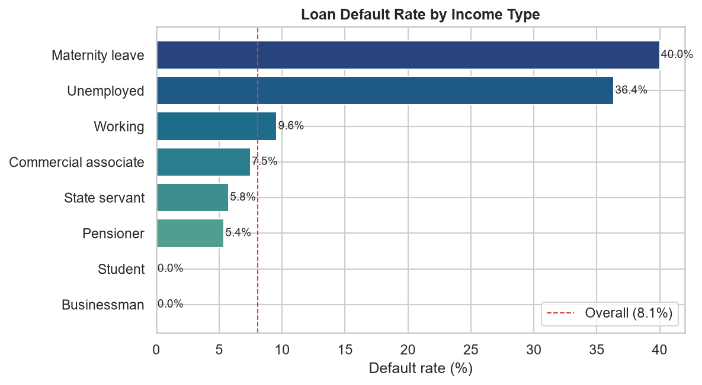
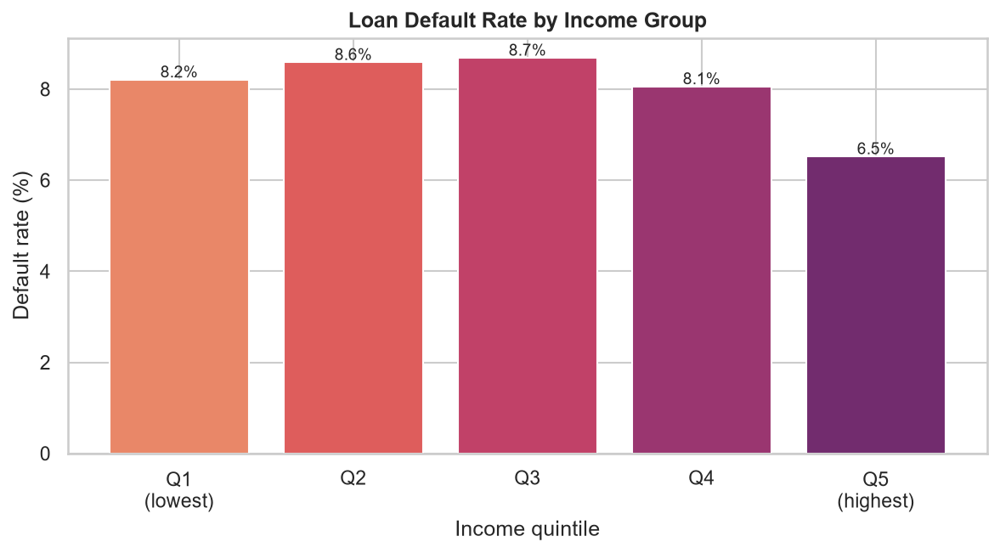

# Credit Risk Analysis — Exploratory Data Analysis

Exploratory Data Analysis (EDA) of consumer loan applications to identify the
customer characteristics and financial factors associated with loan default.
The goal is to surface patterns that can support more informed, lower-risk
credit decisions.

> Internship project. The analysis is implemented end-to-end in a single,
> reproducible Jupyter notebook: [`notebook/credit_eda.ipynb`](notebook/credit_eda.ipynb).

---

## Dataset

- **Source:** [Home Credit Default Risk](https://www.kaggle.com/c/home-credit-default-risk) (`application_data.csv`)
- **Size:** 307,511 applications × 122 features
- **Target:** `TARGET` — `1` if the client had payment difficulties (default), `0` otherwise
- **Domain:** Finance / Credit risk

The dataset is **not** included in this repository because of its size. Download
`application_data.csv` from the link above and place it in the `data/` folder:

```
data/application_data.csv
```

---

## Approach

The notebook works through a standard EDA workflow:

1. **Data inspection** — shape, dtypes, and summary statistics.
2. **Data cleaning** — dropped columns with more than 47% missing values
   (122 → 73 columns); imputed remaining categorical gaps with `"Unknown"` and
   numeric gaps with the column **median** (robust to the heavy skew in the data).
3. **Univariate analysis** — target balance and the distributions of income,
   credit, and annuity amounts.
4. **Bivariate analysis** — default behaviour across income, credit amount,
   education, and occupation.
5. **Correlation analysis** — linear relationships between numeric features and
   the target.
6. **Multivariate analysis** — income vs. credit interactions and an engineered
   `INCOME_CREDIT_RATIO` feature.
7. **Risk analysis & recommendations** — default rates segmented by income type
   and income group.

---

## Key Findings

- **The target is highly imbalanced** — only about **8.1%** of applicants
  defaulted, so the vast majority repay their loans.
- **Individual features correlate weakly with default** — the strongest linear
  correlation with `TARGET` is only ~0.08 (`DAYS_BIRTH`), so risk is driven by
  combinations of factors rather than any single variable.
- **Financial imbalance is the clearest signal** — a lower income-to-credit
  ratio (large loan relative to income) is associated with higher default risk.
- **Default rate varies sharply by income type** — unstable income segments
  (Unemployed ~36%, Maternity leave) default far more than the ~8% baseline,
  while pensioners and state servants sit below it.
- **Income level alone is a weak filter** — default rates stay in a narrow
  6.5%–8.7% band across income quintiles, with only the highest quintile
  clearly below average.

### Selected visualizations





---

## Business Recommendations

- Avoid extending high loan amounts to low-income applicants.
- Use the credit-to-income ratio as a first-pass risk filter.
- Apply stricter verification to applicants with unstable income types.
- Flag high-risk occupation and income segments earlier in the approval process.

---

## Repository Structure

```
Credit EDA/
├── data/                 # dataset (not tracked — download separately)
├── notebook/
│   └── credit_eda.ipynb  # full analysis
├── Images/               # exported plots used in this README
├── requirements.txt
├── LICENSE
├── .gitignore
└── README.md
```

---

## Getting Started

```bash
# 1. Clone the repository
git clone <your-repo-url>
cd "Credit EDA"

# 2. (Optional) create a virtual environment
python -m venv .venv
source .venv/bin/activate      # Windows: .venv\Scripts\activate

# 3. Install dependencies
pip install -r requirements.txt

# 4. Add the dataset
#    Download application_data.csv from Kaggle -> place it in data/

# 5. Launch the notebook
jupyter notebook notebook/credit_eda.ipynb
```

Run the cells top to bottom to reproduce the full analysis.

---

## Tech Stack

Python · pandas · NumPy · Matplotlib · Seaborn · Jupyter Notebook

---

## License

Released under the [MIT License](LICENSE).

## Author

**Paras Tirthe**
